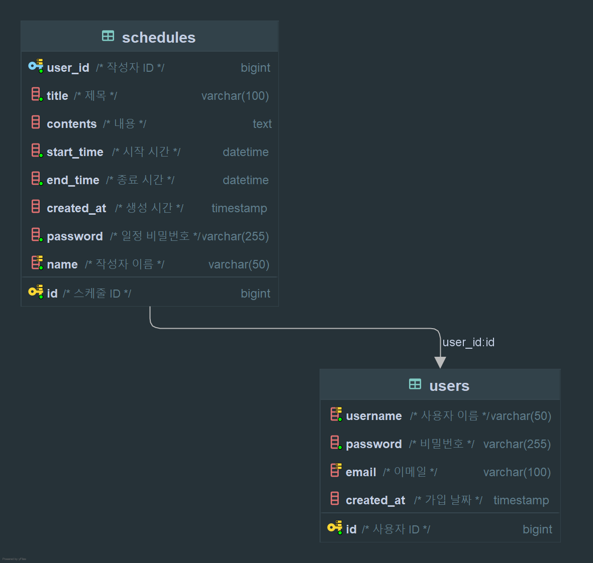

# Scheduler Project

본 프로젝트는 사용자 중심의 일정 관리 시스템을 구현하는 데 목적이 있습니다.
- 사용자는 일정을 손쉽게 등록하고 조회할 수 있습니다.
- 비밀번호 인증을 통해 일정 수정/삭제가 가능합니다.
- 작성자 기반 검색 및 기간 필터링 기능을 통해 일정을 효과적으로 관리할 수 있도록 설계되었습니다.
- 로그인 구현은 미구현 상태 입니다.

---

## 기술 스택

- Java 17
- Spring Boot 3.1.x
- Spring Data JDBC
- H2 / MySQL
- Swagger UI (springdoc-openapi)
- Lombok

---

## 프로젝트 실행 방법

### 1. 프로젝트 클론 및 의존성 설치
```bash
git clone https://github.com/your-repo/scheduler.git
cd scheduler
./gradlew build
```

### 2. 어플리케이션 실행
```bash
./gradlew bootRun
```

### 3. Swagger 접속
서버 실행 후 아래 URL에서 API 명세 확인 가능  
👉 [http://localhost:8080/swagger-ui/index.html](http://localhost:8080/swagger-ui/index.html)

---

## 주요 기능 요약

- 회원 가입 (유저 생성)
- 일정 등록 (작성자, 비밀번호 포함)
- 일정 단건/전체 조회
- 조건부 검색 (작성자, 기간 필터링)
- 일정 수정 및 삭제 (비밀번호 인증)
- 페이징 처리된 일정 목록 조회

---

## 📁 폴더 구조

```
src
└── main
    ├── java
    └── com.example.scheduler
        ├── SchedulerApplication.java         # Spring Boot 애플리케이션 실행 클래스
        │
        ├── controller                        # API 요청 처리
        │    ├── SchedulerController.java
        │    └── UserController.java
        │
        ├── DTO                               # 클라이언트와 주고받는 데이터 (Request/Response DTO)
        │    ├── PasswordRequestDto.java
        │    ├── SchedulerRequestDto.java
        │    ├── SchedulerResponseDto.java
        │    ├── UserRequestDto.java
        │    └── UserResponseDto.java
        │
        ├── entity                            # DB 테이블과 매핑되는 Entity 클래스
        │    ├── Scheduler.java
        │    └── User.java
        │
        ├── exception                         # 커스텀 예외, 전역 예외 처리 클래스
        │    ├── GlobalExceptionHandler.java
        │    └── PasswordException.java
        │
        ├── repository                        # DB 접근 계층 (JdbcTemplate 등)
        │    ├── JdbcTemplateSchedulerRepository.java
        │    ├── JdbcTemplateUserRepository.java
        │    ├── SchedulerRepository.java
        │    └── UserRepository.java
        │
        └── service                           # 비즈니스 로직
            ├── SchedulerService.java
            ├── SchedulerServiceImpl.java
            ├── UserService.java
            └── UserServiceImpl.java
```


---


## 예외 처리 구조

본 프로젝트는 전역 예외 처리 방식을 도입하여 일관된 에러 응답을 제공합니다.

### 구조 설명

- `@ControllerAdvice`를 사용한 전역 예외 처리 클래스
- `@ExceptionHandler`를 통해 개별 예외에 맞는 응답 처리
- 클라이언트는 항상 동일한 JSON 구조로 에러를 받게 되어 처리 일관성 확보

### 주요 예외 클래스

| 예외 클래스 | 설명 |
|-------------|------|
| `PasswordException` | 일정 수정/삭제 시 비밀번호 불일치 (401) |
| `GlobalExceptionHandler` | 모든 예외를 핸들링하는 중앙 처리 클래스 |

### 공통 에러 응답 예시
```json
{
  "status": 404,
  "message": "존재하지 않는 일정입니다.",
  "timestamp": "2025-03-26T15:30:00"
}
```

---

## API 명세서

### Swagger 참조
본 프로젝트의 전체 API 명세서는 Swagger를 통해 자동 생성됩니다.
 - http://localhost:8080/swagger-ui/index.html

Swagger UI는 서버 실행 후 접속할 수 있습니다.

---

### 일정 생성 API
- **URL**: `POST /schedules`
- **설명**: 새 일정을 등록합니다.
- **Request Body**
```json
{
  "title": "제목1",
  "contents": "내용1",
  "startTime": "2025-03-26T10:00:00",
  "endTime": "2025-03-26T12:00:00",
  "password": "1234",
  "name": "이름1",
  "userId": 1
}
```
- **Response**
```json
{
  "id": 1,
  "title": "제목1",
  "contents": "내용1",
  "startTime": "2025-03-26T10:00:00",
  "endTime": "2025-03-26T12:00:00",
  "createdAt": "2025-03-24T15:26:21.0372115",
  "updateAt": "2025-03-24T15:26:21.0372115",
  "name": "이름1",
  "userId": 1
}
```
- **Response Code**: `200 OK`, `400 Bad Request`
#### 예외 명세
- `400 Bad Request`: 잘못된 입력 값
- `500 Internal Server Error`: 서버 오류

---

### 일정 단건 조회 API
- **URL**: `GET /schedules/{id}`
- **설명**: ID 기반으로 단일 일정 조회
- **Response**
```json
{
  "id": 1,
  "title": "제목1",
  "contents": "내용1",
  "startTime": "2025-03-26T10:00:00",
  "endTime": "2025-03-26T12:00:00",
  "createdAt": "2025-03-24T15:26:21",
  "updateAt": "2025-03-24T15:30:00",
  "name": "이름1",
  "userId": 1
}
```
- **Response Code**: `200 OK`, `404 Not Found`

#### 예외 명세
- `404 Not Found`: 존재하지 않는 일정 ID
- `500 Internal Server Error`: 서버 오류

---

### 조건부 일정 조회 API
- **URL 예시**:
  - 이름 + 날짜: `GET /schedules/search?name=이름1&date=2025-03-01`
  - 이름 + 최근 6개월: `GET /schedules/search?name=이름1&months=6`
  - 최근 6개월: `GET /schedules/search?months=6`
  - 이름만: `GET /schedules/search?name=이름1`
- **설명**: 작성자명, 수정일, 개월 수를 기준으로 일정 조건 검색
- **Response**
```json
[
  {
    "id": 1,
    "title": "제목1",
    "contents": "내용1",
    "startTime": "2025-03-26T10:00:00",
    "endTime": "2025-03-26T12:00:00",
    "createdAt": "2025-03-24T15:26:21",
    "updateAt": "2025-03-24T15:30:00",
    "name": "이름1",
    "userId": 1
  }
]
```
- **Response Code**: `200 OK`

#### 예외 명세
- `500 Internal Server Error`: 서버 오류

---

### 일정 전체 조회 API
- **URL**: `GET /schedules`
- **설명**: 모든 일정 최신순 조회
- **Response**
```json
[
  {
    "id": 1,
    "title": "제목1",
    "contents": "내용1",
    "startTime": "2025-03-26T10:00:00",
    "endTime": "2025-03-26T12:00:00",
    "createdAt": "2025-03-24T15:26:21",
    "updateAt": "2025-03-24T15:30:00",
    "name": "이름1",
    "userId": 1
  },
  {
    "id": 2,
    "title": "제목2",
    "contents": "내용2",
    "startTime": "2025-03-27T09:00:00",
    "endTime": "2025-03-27T11:00:00",
    "createdAt": "2025-03-24T15:30:00",
    "updateAt": "2025-03-24T15:35:00",
    "name": "이름2",
    "userId": 2
  }
]
```
- **Response Code**: `200 OK`

---

### 일정 수정 API
- **URL**: `PUT /schedules/{id}`
- **설명**: ID와 비밀번호를 통해 일정 수정
- **Request Body**
```json
{
  "password": "1234",
  "title": "수정된 제목",
  "contents": "수정된 내용"
}
```
- **Response**
```json
{
  "id": 1,
  "title": "수정된 제목",
  "contents": "수정된 내용",
  "startTime": "2025-03-26T10:00:00",
  "endTime": "2025-03-26T12:00:00",
  "createdAt": "2025-03-24T16:00:00",
  "updateAt": "2025-03-26T11:00:00",
  "name": "이름1",
  "userId": 1
}
```
- **Response Code**:
  - `200 OK`
  - `401 Unauthorized`: 비밀번호 불일치
  - `404 Not Found`: ID 존재하지 않음

#### 예외 명세
- `401 Unauthorized`: 비밀번호 불일치
- `404 Not Found`: ID 없음
- `500 Internal Server Error`: 서버 오류

---

### 일정 삭제 API
- **URL**: `DELETE /schedules/{id}`
- **설명**: 비밀번호 인증 후 일정 삭제
- **Request Body**
```json
{
  "password": "1234"
}
```
- **Response Code**:
  - `200 OK`: 삭제 성공
  - `401 Unauthorized`: 비밀번호 불일치
  - `404 Not Found`: ID 존재하지 않음

#### 예외 명세
- `401 Unauthorized`: 비밀번호 불일치
- `404 Not Found`: ID 없음
- `500 Internal Server Error`: 서버 오류

---

### 회원가입 API
- **URL**: `POST /users`
- **설명**: 새로운 유저 등록
- **Request Body**
```json
{
  "username": "이름1",
  "password": "1234",
  "email": "test1234@example.com"
}
```
- **Response**
```json
{
  "id": 1,
  "username": "이름1",
  "email": "test1234@example.com",
  "createdAt": "2025-03-25T13:53:07"
}
```
- **Response Code**: `200 OK`, `400 Bad Request`

#### 예외 명세
- 400 Bad Request: 유효성 검증 실패 (이름 길이, 이메일 형식 등)
- 500 Internal Server Error: 서버 오류

---

### 페이지네이션 API
- **URL**: `GET /schedules/paging?page=0&size=2`
- **설명**: 페이지 단위 일정 조회
- **Response**
```json
[
  {
    "id": 1,
    "title": "제목1",
    "contents": "내용1",
    "startTime": "2025-03-26T10:00:00",
    "endTime": "2025-03-26T12:00:00",
    "createdAt": "2025-03-24T15:26:21",
    "updateAt": "2025-03-24T15:30:00",
    "name": "이름1",
    "userId": 1
  },
  {
    "id": 2,
    "title": "제목2",
    "contents": "내용2",
    "startTime": "2025-03-27T09:00:00",
    "endTime": "2025-03-27T11:00:00",
    "createdAt": "2025-03-24T15:30:00",
    "updateAt": "2025-03-24T15:35:00",
    "name": "이름2",
    "userId": 2
  }
]
```
- **Response Code**: `200 OK`

#### 예외 명세
- 500 Internal Server Error: 서버 오류

<br>

---

## 에러 및 예외 명세서

| 상태 코드 | 설명 |
|-----------|------|
| 400 Bad Request | 유효성 검증 실패 (ex. 필수 값 누락, 잘못된 입력 형식 등) |
| 401 Unauthorized | 비밀번호 불일치 또는 인증 실패 |
| 404 Not Found | 요청한 리소스(id 등)가 존재하지 않음 |
| 500 Internal Server Error | 서버 내부 에러 (예기치 못한 오류) |

---

## **ERD**

- **이미지**


### **ERD 설명**
#### users 테이블

|          | 타입           | 제약 조건            | 설명           |
|----------|----------------|----------------------|----------------|
| id       | BIGINT         | PK, AUTO_INCREMENT   | 유저 고유 ID   |
| username | VARCHAR(10)    | NOT NULL             | 사용자 이름     |
| password | VARCHAR(255)   | NOT NULL             | 비밀번호 (암호화) |
| email    | VARCHAR(255)   |                      | 이메일 주소     |
| created_at | DATETIME       | DEFAULT CURRENT_TIMESTAMP | 생성 시간 |

---

#### schedules 테이블

|          | 타입           | 제약 조건            | 설명             |
|----------|----------------|----------------------|------------------|
| id       | BIGINT         | PK, AUTO_INCREMENT   | 스케줄 고유 ID   |
| title    | VARCHAR(20)    | NOT NULL             | 제목             |
| contents | VARCHAR(200)   | NOT NULL             | 내용             |
| start_time | DATETIME       | NOT NULL             | 시작 시간         |
| end_time | DATETIME       | NOT NULL             | 종료 시간         |
| password | VARCHAR(255)   | NOT NULL             | 수정/삭제용 비밀번호 |
| name     | VARCHAR(50)    | NOT NULL             | 작성자 이름        |
| created_at | DATETIME       | DEFAULT CURRENT_TIMESTAMP | 생성 시간     |
| updated_at | DATETIME       | DEFAULT CURRENT_TIMESTAMP ON UPDATE CURRENT_TIMESTAMP | 수정 시간 |
| user_id  | BIGINT         | FK → users.id        | 유저 ID (작성자)   |

---

### 관계 설명

- `users` (1) —— (N) `schedules`
  - 하나의 유저는 여러 개의 스케줄을 가진 수 있음
  - `schedules.user_id`는 `users.id`를 참조하는 외래 키


