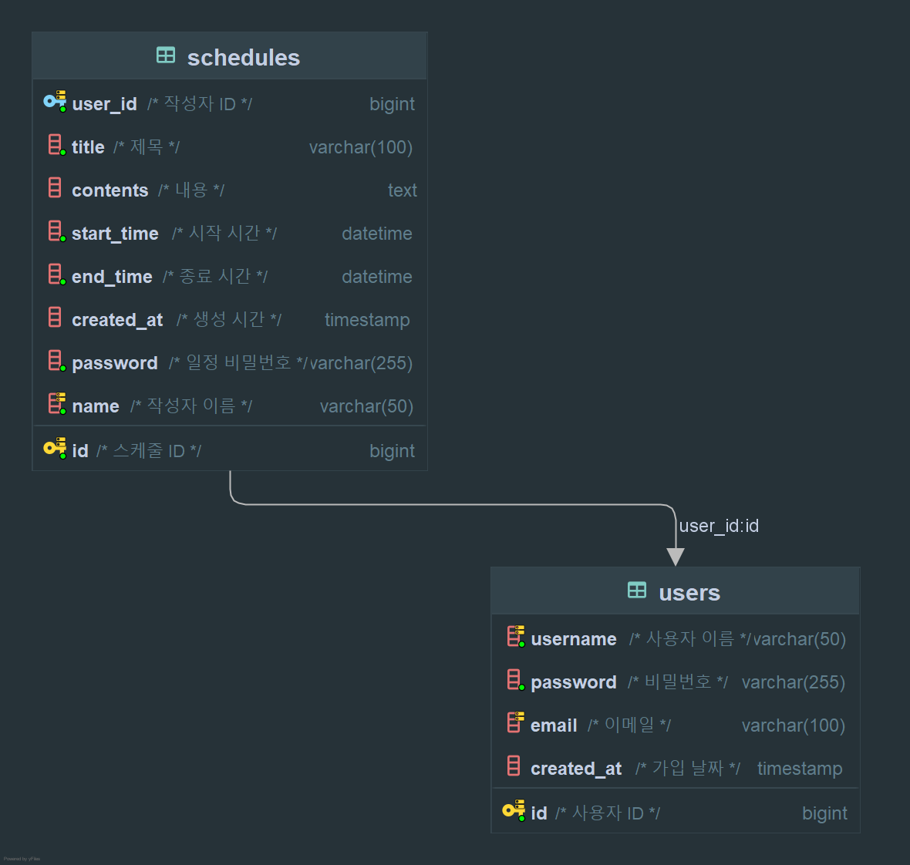

# Scheduler Project

This project is designed to implement a user-centric schedule management system.
- Users can easily create and view their schedules.
- Schedule updates and deletions are protected with password authentication.
- Schedules can be filtered by author and time range for efficient management.
- User login functionality is **not implemented**.

---

## Tech Stack

- Java 17
- Spring Boot 3.1.x
- Spring Data JDBC
- H2 / MySQL
- Swagger UI (springdoc-openapi)
- Lombok

---

## Getting Started

### 1. Clone the repository & install dependencies
```bash
git clone https://github.com/your-repo/scheduler.git
cd scheduler
./gradlew build
```

### 2. Run the application
```bash
./gradlew bootRun
```

### 3. Access Swagger UI
After running the server, access Swagger for full API documentation:  
👉 [http://localhost:8080/swagger-ui/index.html](http://localhost:8080/swagger-ui/index.html)

---

## Key Features

- User registration
- Schedule creation (with author and password)
- View single or all schedules
- Filter schedules by author or recent period
- Update and delete schedules with password authentication
- Paginated schedule list

---

## 📁 Project Structure

```
src
└── main
    ├── java
    └── com.example.scheduler
        ├── SchedulerApplication.java         # Spring Boot application entry point
        │
        ├── controller                        # API controllers
        │    ├── SchedulerController.java
        │    └── UserController.java
        │
        ├── DTO                               # Data Transfer Objects (request/response)
        │    ├── PasswordRequestDto.java
        │    ├── SchedulerRequestDto.java
        │    ├── SchedulerResponseDto.java
        │    ├── UserRequestDto.java
        │    └── UserResponseDto.java
        │
        ├── entity                            # Entity classes mapped to DB tables
        │    ├── Scheduler.java
        │    └── User.java
        │
        ├── exception                         # Custom exceptions and global handler
        │    ├── GlobalExceptionHandler.java
        │    └── PasswordException.java
        │
        ├── repository                        # Data access layer (JdbcTemplate)
        │    ├── JdbcTemplateSchedulerRepository.java
        │    ├── JdbcTemplateUserRepository.java
        │    ├── SchedulerRepository.java
        │    └── UserRepository.java
        │
        └── service                           # Business logic layer
            ├── SchedulerService.java
            ├── SchedulerServiceImpl.java
            ├── UserService.java
            └── UserServiceImpl.java
```

---

## Exception Handling

This project uses a global exception handling strategy to provide consistent error responses.

### Structure Overview

- `@ControllerAdvice` is used for global exception handling
- Specific exceptions are handled via `@ExceptionHandler`
- All errors are returned in a unified JSON format

### Main Exception Classes

| Class | Description |
|-------|-------------|
| `PasswordException` | Raised when an invalid password is provided (401) |
| `GlobalExceptionHandler` | Handles all exceptions and returns standardized response |

### Example Error Response
```json
{
  "status": 404,
  "message": "Schedule not found.",
  "timestamp": "2025-03-26T15:30:00"
}
```

---
## API Documentation

### Swagger UI
Full API documentation is available through Swagger after running the server:
- http://localhost:8080/swagger-ui/index.html

---

### Endpoints Summary

| Method | Endpoint | Description |
|--------|----------|-------------|
| POST | `/schedules` | Create a new schedule |
| GET  | `/schedules/{id}` | Get schedule by ID |
| GET  | `/schedules` | Get all schedules (latest first) |
| GET  | `/schedules/search` | Filter schedules by author or period |
| PUT  | `/schedules/{id}` | Update a schedule (with password) |
| DELETE | `/schedules/{id}` | Delete a schedule (with password) |
| POST | `/users` | Register new user |
| GET  | `/schedules/paging` | Get paginated list of schedules |

---

## Error & Response Codes

| Status Code | Description |
|-------------|-------------|
| 400 Bad Request | Validation failure (e.g. missing fields, format error) |
| 401 Unauthorized | Password mismatch or authentication failed |
| 404 Not Found | Requested resource not found |
| 500 Internal Server Error | Unexpected server-side error |

---

## ERD (Entity Relationship Diagram)



### users Table

| Column      | Type          | Constraints                    | Description        |
|-------------|---------------|--------------------------------|--------------------|
| id          | BIGINT        | PK, AUTO_INCREMENT             | Unique user ID     |
| username    | VARCHAR(10)   | NOT NULL                       | Username           |
| password    | VARCHAR(255)  | NOT NULL                       | Password (hashed)  |
| email       | VARCHAR(255)  |                                | Email address      |
| created_at  | DATETIME      | DEFAULT CURRENT_TIMESTAMP      | Account created at |

---

### schedules Table

| Column      | Type          | Constraints                                               | Description              |
|-------------|---------------|-----------------------------------------------------------|--------------------------|
| id          | BIGINT        | PK, AUTO_INCREMENT                                        | Unique schedule ID       |
| title       | VARCHAR(20)   | NOT NULL                                                 | Schedule title           |
| contents    | VARCHAR(200)  | NOT NULL                                                 | Schedule description     |
| start_time  | DATETIME      | NOT NULL                                                 | Start time               |
| end_time    | DATETIME      | NOT NULL                                                 | End time                 |
| password    | VARCHAR(255)  | NOT NULL                                                 | Password for modification|
| name        | VARCHAR(50)   | NOT NULL                                                 | Author name              |
| created_at  | DATETIME      | DEFAULT CURRENT_TIMESTAMP                                | Schedule created at      |
| updated_at  | DATETIME      | DEFAULT CURRENT_TIMESTAMP ON UPDATE CURRENT_TIMESTAMP    | Last update time         |
| user_id     | BIGINT        | FOREIGN KEY → users.id                                   | Author (user) ID         |

---

### Relationship

- One `user` can have many `schedules`
- The `schedules.user_id` column refers to `users.id` as a foreign key

---
